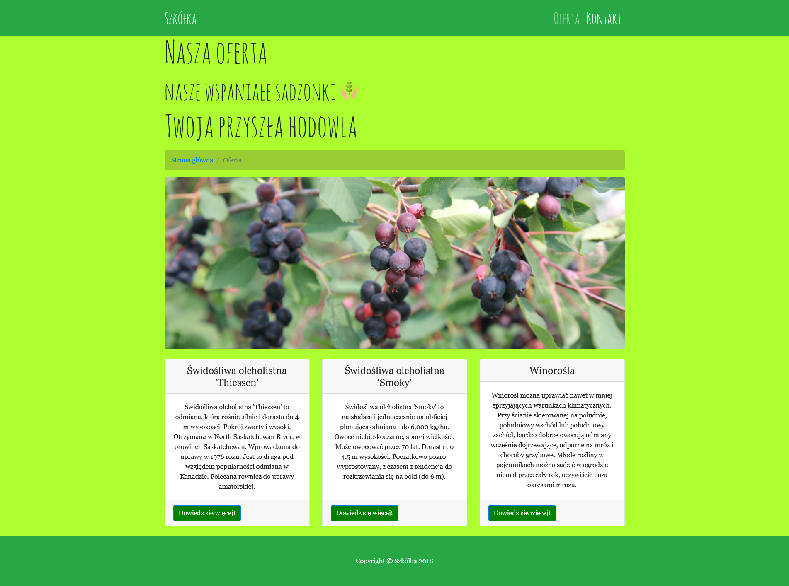
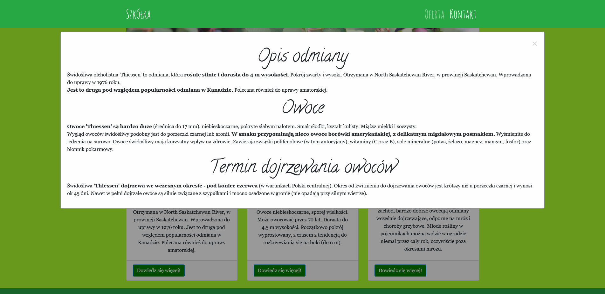
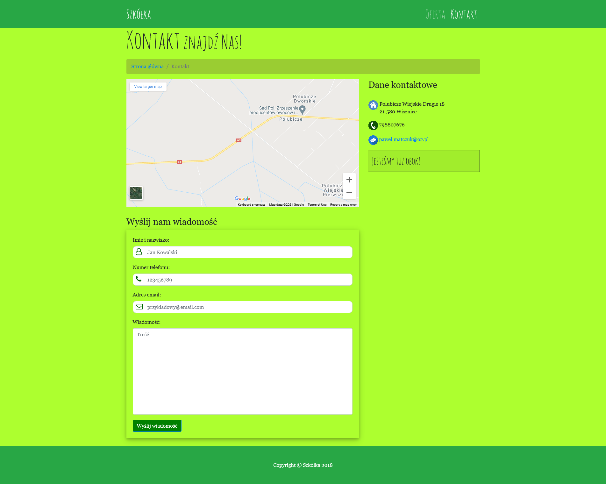

# Saskatoon Site

### Saskatoon berry store website

The goal of this project is to create a website for the saskatoon berry store.

## Technology Stack

* JavaScript
* HTML5 + CSS3

## Preview

<table>
    <tr>
        <td>
            
Homepage

            
        </td>
        <td>
            
Store offer

            
        </td>
    </tr>
        <td>
            
Product Description

            
        </td>
        <td>
            
Contact & Localization

            
        </td>
    </tr>
</table>

## Author

* **Michał Koziara** 
